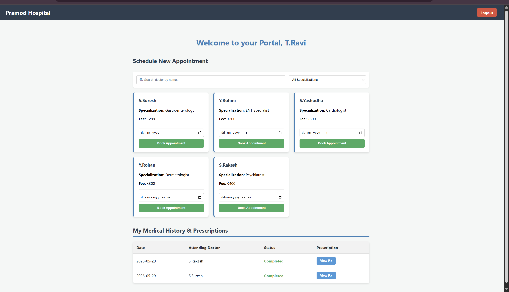
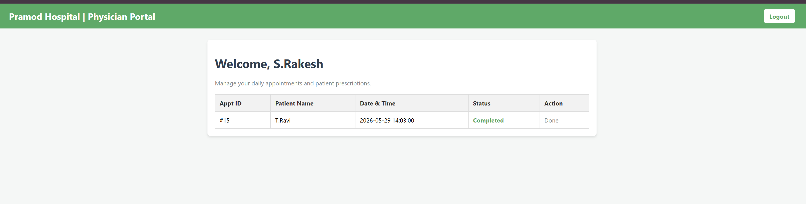
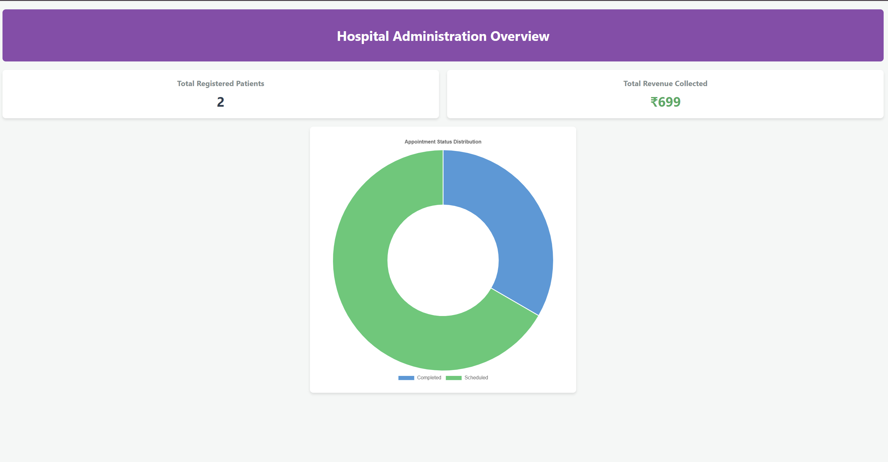

# 🏥 Hospital Management System

<div align="center">


</div>

---

## 📌 Project Overview

A **Full-Stack Hospital Management System** built using **Flask + MySQL** to demonstrate enterprise-level backend engineering, relational database design, and secure role-based workflow architecture.

This project focuses heavily on:

- ⚙️ Backend system design
- 🧠 Database architecture
- 🔐 Authentication & security practices
- 📊 Real-time admin analytics
- 🧩 Relational data integrity
- 🚀 Scalable workflow automation

Designed specifically to showcase **software engineering placement-level backend skills**.

---

# ✨ Core Features

## 👨‍⚕️ Patient Portal

- 🔐 Secure patient registration & login
- 📅 Dynamic appointment booking system
- ⚡ Backend concurrency checks to prevent double-booking
- 🧾 View complete medical history
- 📋 Access doctor prescriptions

---

## 🩺 Doctor Portal

- 📆 View daily appointment schedules
- 💊 Create digital e-prescriptions
- 🧠 Automated backend billing workflow
- 📁 Access patient medical records

---

## 🛠️ Admin Portal

- 📊 Real-time hospital analytics dashboard
- 💰 Live revenue monitoring
- 👨‍⚕️ Active doctor tracking
- ✅ Total completed appointment metrics
- 🧾 Invoice monitoring system

---

# 🧠 Enterprise Backend Architecture Highlights

## ⚡ Automated Post-Paid Billing Workflow

When a doctor submits a prescription:

1. Prescription is stored in the database
2. Backend automatically generates an invoice
3. Invoice status is marked as **Paid**
4. Revenue metrics instantly update on Admin Dashboard

This workflow simulates a real-world hospital billing pipeline using backend automation logic.

---

## 🗃️ Database Integrity & Relational Design

The MySQL database architecture uses:

- ✅ Foreign Key Constraints
- ✅ ON DELETE CASCADE
- ✅ Normalized relational schema
- ✅ Multi-table JOIN queries

### Example

Deleting a doctor automatically removes:

- Related appointments
- Prescriptions
- Billing invoices

This prevents:

- ❌ Orphaned records
- ❌ Inconsistent analytics
- ❌ Broken relational references

---

## 🔍 Advanced SQL Querying

The backend uses complex relational queries including:

- INNER JOIN
- Aggregate Queries
- Revenue Calculations
- Patient History Retrieval
- Dashboard Analytics

### Example Use Cases

- Fetching complete patient medical history
- Generating admin dashboard statistics
- Revenue tracking per appointment

---

# 🔐 Security Standards

## ✅ Password Security

Implemented using:

- `Werkzeug Password Hashing`

Features:

- Secure password hashing
- Password verification
- Protection against plaintext credential storage

---

## ✅ Environment Variable Protection

Sensitive credentials are secured using:

- `.env`
- `python-dotenv`

Hidden secrets include:

- Flask Secret Key
- MySQL Database URI

---

## ✅ Git Security Practices

A properly configured `.gitignore` ensures:

- `.env` files are never pushed
- `__pycache__/` is ignored
- Virtual environments remain excluded
- Sensitive runtime files stay local

---

# 🏗️ Tech Stack

| Layer | Technologies |
|---|---|
| Backend | Python, Flask, Flask-SQLAlchemy |
| Database | MySQL |
| Frontend | HTML5, CSS3, Vanilla JavaScript |
| Security | Werkzeug, Python-Dotenv |
| ORM | SQLAlchemy |

---

# 📸 UI Screenshots

> Replace these placeholders with actual screenshots before publishing.

## 🏠 Patient Dashboard



---

## 🩺 Doctor Panel



---

## 📊 Admin Analytics Dashboard



---

# 🗂️ Project Structure

```bash
Hospital-Management-System/
│
├── static/
│   ├── css/
│   ├── js/
│   └── images/
│
├── templates/
│
├── models/
│
├── routes/
│
├── database/
│   └── database.sql
│
├── .env
├── .gitignore
├── app.py
├── requirements.txt
└── README.md
```

---

# ⚙️ Local Setup Instructions

## 1️⃣ Clone the Repository

```bash
git clone https://github.com/your-username/hospital-management-system.git
```

```bash
cd hospital-management-system
```

---

## 2️⃣ Create Virtual Environment

### Windows

```bash
python -m venv venv
venv\Scripts\activate
```

### Linux / Mac

```bash
python3 -m venv venv
source venv/bin/activate
```

---

## 3️⃣ Install Dependencies

```bash
pip install -r requirements.txt
```

---

## 4️⃣ Configure MySQL Database

Create a new MySQL database:

```sql
CREATE DATABASE hospital_management;
```

Import the provided SQL schema:

```bash
mysql -u root -p hospital_management < database/database.sql
```

---

## 5️⃣ Setup Environment Variables

Create a `.env` file in the root directory:

```env
SECRET_KEY=your_secret_key_here

MYSQL_HOST=localhost
MYSQL_USER=root
MYSQL_PASSWORD=your_password
MYSQL_DB=hospital_management
```

---

## 6️⃣ Run the Application

```bash
python app.py
```

Application will run on:

```bash
http://127.0.0.1:5000
```

---

# 📊 System Workflow

```text
Patient Books Appointment
            ↓
Doctor Views Schedule
            ↓
Doctor Writes Prescription
            ↓
Backend Generates Invoice
            ↓
Revenue Dashboard Updates
```

---

# 🚀 Future Enhancements

- 💳 Payment Gateway Integration
- 📄 PDF Invoice Generation
- 📧 Email & SMS Notifications
- ☁️ Docker Deployment
- 🔐 JWT Authentication
- 📱 Responsive Mobile UI
- 📈 Advanced Analytics Dashboard
- 🧪 Automated Unit Testing
- 🌐 REST API Support

---

# 🧪 Example Engineering Concepts Demonstrated

This project demonstrates practical understanding of:

- RESTful Backend Architecture
- Role-Based Access Control (RBAC)
- SQL Database Normalization
- ORM Design with SQLAlchemy
- Backend Workflow Automation
- Secure Credential Management
- Relational Database Integrity
- Real-Time Dashboard Logic
- Scalable Flask Application Structure

---

# 👨‍💻 Author

**Your Name**

- GitHub: [https://github.com/Thatipramod/hospital-management-system](https://github.com/Thatipramod/hospital-management-system)
- LinkedIn: [https://www.linkedin.com/in/thati-pramod](https://www.linkedin.com/in/thati-pramod/)

---

# ⭐ Why This Project Matters

This project was built to simulate real-world hospital workflows while showcasing:

- Production-style backend engineering
- Clean relational database architecture
- Secure authentication systems
- Automated business logic pipelines
- Full-stack integration skills

It highlights the ability to design systems beyond CRUD applications and demonstrates practical software engineering problem-solving.

---

# 📄 License

This project is licensed under the MIT License.

---

<div align="center">

### ⭐ If you found this project useful, consider giving it a star!

</div>
